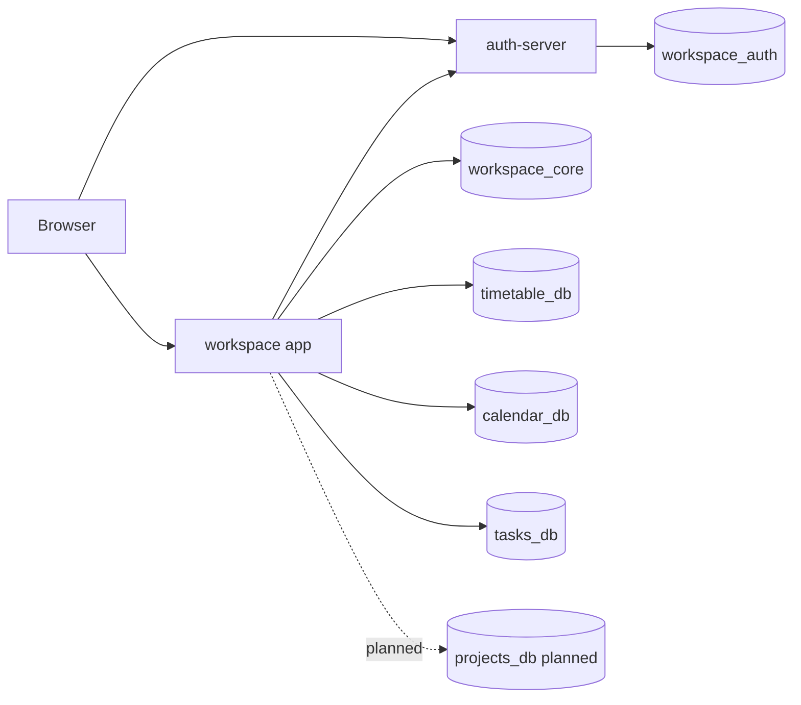

# 핸드아웃

## 한 줄 요약
- 워크스페이스 앱은 인증, 공통 프로필/모듈 설정, 기능 데이터를 분리해서 장기적으로 모듈별 DB 구조로 확장할 수 있게 정리했다.

## 현재 서비스 구조

## 데이터 소유권
| 영역 | 저장소 | 상태 |
| --- | --- | --- |
| 인증 | `workspace_auth` | 운영 기준 source of truth |
| 공통 프로필/모듈 설정 | `workspace_core` | 런타임 연결 완료 |
| 시간표 | `timetable_db` | 운영 중, legacy `User` 축소 예정 |
| 캘린더 | `calendar_db` | 런타임 분리 완료 |
| 할 일 | `tasks_db` | 런타임 분리 완료 |
| 프로젝트 | `projects_db` | 예정 |

## 사용자 식별 규칙
- 전역 사용자 키는 `workspace_auth.User.id`다.
- 각 모듈 DB는 소유 키로 `authUserId`를 저장한다.
- cross-db FK는 사용하지 않고 애플리케이션 레벨 참조로 소유권을 해석한다.
- 보호 API는 클라이언트가 보낸 `userId`를 신뢰하지 않는다.

## 워크스페이스 셸
- 기본 모듈은 `timetable`, `mypage`다.
- 활성 모듈 목록은 `workspace_core`에 저장한다.
- `workspace_core` 장애 시 사용자별 local cache로 fallback한다.
- 장애 중 바뀐 모듈 구성은 core 복구 후 서버로 replay한다.

## 현재 완료된 것
- `workspace_core` 분리 및 프로필/모듈 상태 런타임 연결
- `calendar_db` 런타임 분리
- `tasks_db` 런타임 분리
- split DB URL fail-fast 처리
- Grafana/Prometheus monitoring stack 구성
- `DOCS` 기준 문서 통폐합

## 다음 단계
1. `projects_db` schema/client와 프로젝트 모듈 1차 구현
2. `timetable_db` legacy `User` 축소
3. legacy `CalendarEvent`/`TaskItem` 정리 시점 확정
4. split DB smoke check 자동화
5. Cloudflare CDN/WAF 1차 적용

## 자세한 문서
- [ARCHITECTURE.md](/C:/workflow-management/DOCS/ARCHITECTURE.md)
- [FILE_SPEC.md](/C:/workflow-management/DOCS/FILE_SPEC.md)
- [API_SPEC.md](/C:/workflow-management/DOCS/API_SPEC.md)
- [DEPLOYMENT.md](/C:/workflow-management/DOCS/DEPLOYMENT.md)
- [TODO.md](/C:/workflow-management/DOCS/TODO.md)
