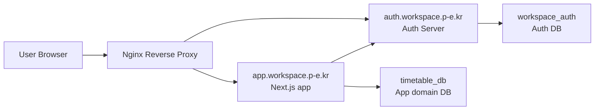
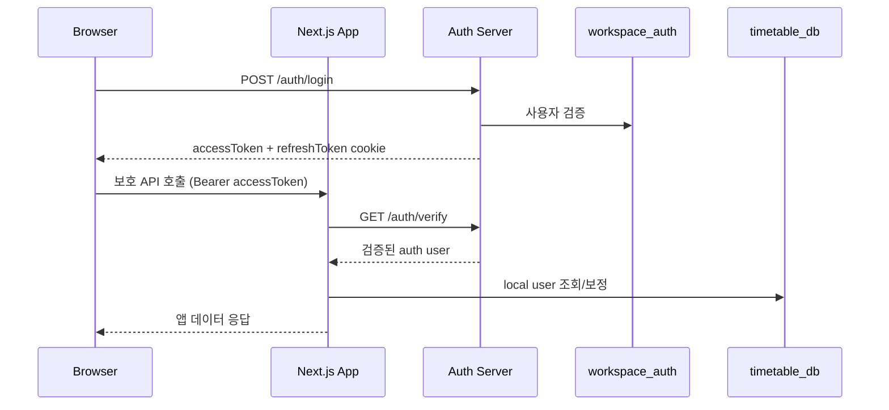
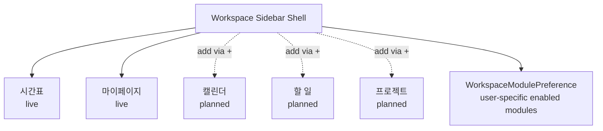
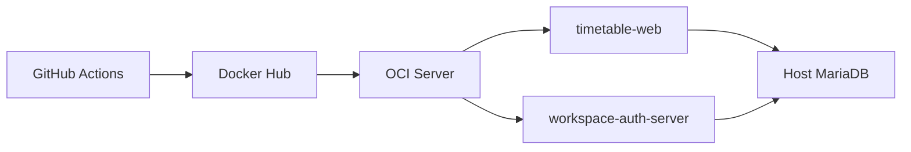

# Project Handout

## 1. 문서 목적
- 이 문서는 현재 프로젝트를 짧은 시간 안에 설명하기 위한 공유용 요약 문서다.
- 기술 구조, 인증 흐름, 데이터 소유권, 확장 방향을 한눈에 볼 수 있도록 정리한다.
- `ARCHITECTURE.md`가 기준 설계서라면, 이 문서는 발표/인수인계/정리용 handout이다.

## 2. 프로젝트 한 줄 요약
- `MyTimeTable`은 시간표 서비스를 시작점으로 삼아, 장기적으로 여러 개인 생산성 모듈을 한 워크스페이스 안에서 운영하는 서비스다.
- 인증은 별도 `auth-server`가 담당하고, 루트 앱은 인증 결과를 신뢰해 앱 도메인 데이터만 처리한다.

## 3. 현재 운영 구조

### 현재 운영 포인트
- 앱 도메인: `https://app.workspace.p-e.kr`
- 인증 도메인: `https://auth.workspace.p-e.kr`
- 앱 컨테이너: `timetable-web`
- 인증 컨테이너: `workspace-auth-server`
- Auth Server CORS/HTTPS/OAuth 동작 검증 완료

## 4. 책임 분리

| 영역 | 책임 |
| --- | --- |
| `auth-server` | 회원가입, 로그인, Refresh, Verify, Logout, OAuth |
| `workspace_auth` | 계정, 비밀번호 해시, Refresh Token, OAuth 계정 |
| 루트 앱 | 시간표, 별명, 워크스페이스 모듈 구성 |
| `timetable_db` | 앱 도메인 데이터와 사용자별 모듈 구성 저장 |

### 핵심 원칙
- 인증의 진실 원본은 `workspace_auth`
- 앱은 자체 세션을 발급하지 않음
- 앱 보호 API는 클라이언트가 보낸 `userId`를 신뢰하지 않음
- 장기 사용자 식별자는 이메일이 아니라 `authUserId`

## 5. 인증 흐름

### 인증 설계 포인트
- Access Token은 클라이언트가 Bearer로 사용
- Refresh Token은 `HttpOnly` 쿠키
- 앱은 `/auth/verify` 결과를 신뢰해 로컬 사용자 row를 연결
- `authUserId`가 있으면 그걸 우선 사용하고, 이메일은 과도기 fallback

## 6. 워크스페이스 모듈 구조

### 현재 구현 상태
- 사이드바에서 활성 모듈을 `X`로 제거 가능
- 하단 `+` 버튼으로 모듈 추가 모달 오픈 가능
- 사용자별 활성 모듈 목록은 서버에 저장
- 기본 활성 모듈은 `timetable`, `mypage`

## 7. 모듈별 저장소 전략

| 모듈 | 현재 저장소 | 계획 저장소 | 상태 |
| --- | --- | --- | --- |
| 시간표 | `timetable_db` | `timetable_db` | live |
| 마이페이지 | `timetable_db` | `profile_db` | live |
| 캘린더 | 없음 | `calendar_db` | planned |
| 할 일 | 없음 | `tasks_db` | planned |
| 프로젝트 | 없음 | `projects_db` | planned |

### 중요한 해석
- 지금은 루트 앱이 단일 Prisma datasource를 사용한다.
- 즉 “모듈별 DB 분리”는 현재 일부는 계획 수준이고, UI에는 현재 저장소와 계획 저장소를 구분해 표시한다.
- 이 구분을 명확히 두는 이유는, 구조적 목표를 표현하되 실제 운영 상태를 과장하지 않기 위해서다.

## 8. 배포 구조

### 배포 특징
- 앱/인증 서버 이미지를 분리
- 운영 DB는 OCI 호스트 OS에서 직접 동작
- 컨테이너는 `host.docker.internal`로 호스트 DB 접근
- Auth Server 배포 시 migration을 선행하고 서버 컨테이너를 교체

## 9. 지금까지 완료된 핵심 작업
- `next-auth` 제거
- 중앙 `auth-server` 분리
- 일반 로그인/회원가입/Refresh/Verify/Logout 구현
- Google/GitHub/Kakao OAuth 구현 및 브라우저 검증
- Auth Server CORS/HTTPS/배포 이슈 해결
- `authUserId` 중심 사용자 매핑 도입
- 사용자별 워크스페이스 모듈 저장 구조 추가

## 10. 남은 과제
- OAuth callback의 `accessToken` query 전달을 one-time code 방식으로 개선
- `timetable_db.User.password` 제거
- 모듈별 전용 DB와 Prisma 클라이언트 분리
- `calendar`, `tasks`, `projects` 중 첫 실제 모듈 구현
- Rate limit / 감사 로그 / secret rotation 같은 운영 보안 강화

## 11. 추천 발표 흐름
1. 왜 인증을 중앙 서버로 분리했는가
2. 현재 운영 구조는 어떻게 생겼는가
3. 왜 `authUserId`가 중요한가
4. 워크스페이스 모듈 구조가 어떻게 확장되는가
5. 지금은 어디까지 구현됐고, 다음은 무엇인가
