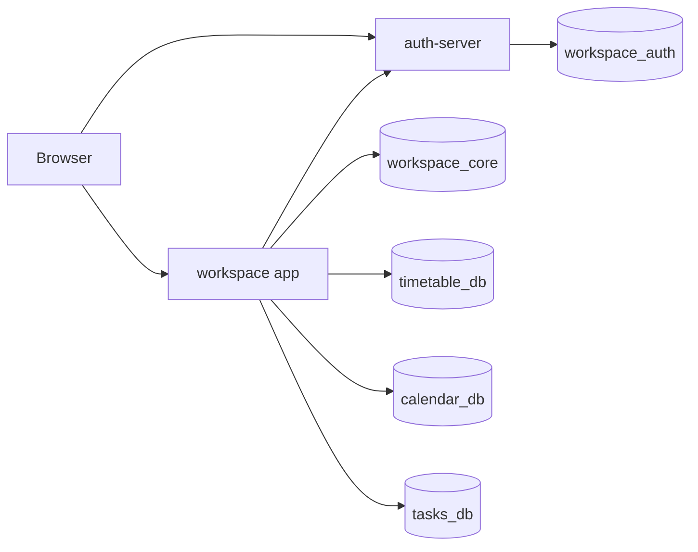
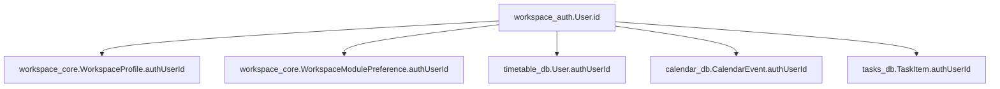

# 핸드아웃

## 한 줄 요약
- 인증은 `workspace_auth`, 공통 프로필/모듈 설정은 `workspace_core`, 기능 데이터는 모듈별 DB로 분리하는 방향으로 워크스페이스를 재구성했다.

## 현재 구조

## 데이터 소유권
| 영역 | 저장소 | 비고 |
| --- | --- | --- |
| 인증 | `workspace_auth` | source of truth |
| 공통 프로필/모듈 설정 | `workspace_core` | `WorkspaceProfile`, `WorkspaceModulePreference`, `WorkspaceModuleState` |
| 시간표 | `timetable_db` | timetable 전용 |
| 캘린더 | `calendar_db` | `CalendarEvent` |
| 할 일 | `tasks_db` | `TaskItem` |
| 프로젝트 | `projects_db` | 예정 |

## 사용자 식별 규칙

## 워크스페이스 셸
- 기본 모듈: `timetable`, `mypage`
- 저장소: `workspace_core`
- core 장애 시 로컬 캐시 fallback
- 복구 후 미반영 모듈 변경 재전송

## 현재 완료된 것
- auth-server 분리
- `workspace_auth` 도입
- `workspace_core` 도입
- `calendar_db` 런타임 분리
- `tasks_db` 런타임 분리
- 모듈 셸 서버 저장 + fallback + replay 처리

## 다음 단계
- `projects_db`와 프로젝트 모듈 구현
- timetable legacy 축소
- split DB smoke check 자동화
